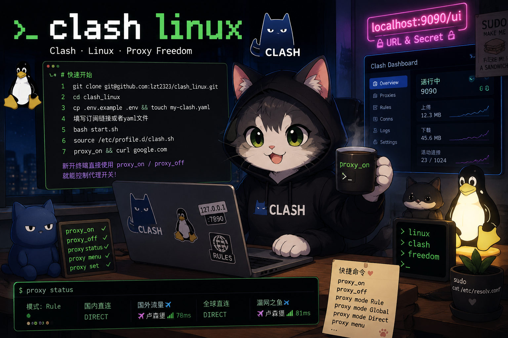
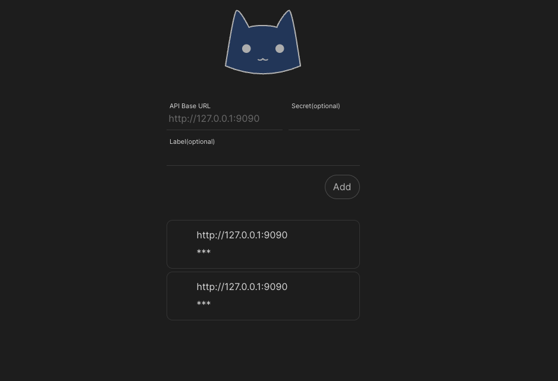

# clash linux

<p align="center">
  
</p>

## 快速开始

```bash
# 1.克隆进入项目目录
git clone git@github.com:lzt2323/clash_linux.git
cd clash_linux
# 2.复制配置文件
cp .env.example .env
touch my-clash.yaml
# 3.填写订阅链接或者yaml文件
# 4.启动运行脚本
bash start.sh
# 5.配置环境变量
source /etc/profile.d/clash.sh
# 6.开启代理
proxy_on
# 7.查看是否能访问Google
curl google.com
```

tips：新开终端直接使用 proxy_on / proxy_off 就能控制代理开关，不需要重复实现上述操作

---

#### 控制面板

1. 设置端口转发

<p align="center">
  
</p>

2. 访问本地端口 [localhost:9090/ui](http://localhost:9090/ui) 输入url和secret

<p align="center">
  
</p>

3. 进入面板

<p align="center">
  
</p>

---

## 终端菜单

项目提供了终端菜单，可以快速切换代理模式和节点，查看网络延迟，适合无ui情况

```bash
proxy menu
```

**切换代理模式**

<p align="center">
  
</p>

**切换节点**

查看当前节点只用看每个group指向哪里，如这个订阅，其他group指向国外流量，国外流量指向卢森堡，so当前节点上卢森堡

<p align="center">
  
</p>

---

## 快捷命令

这里提供了快捷命令能够直接切换代理模式和节点

```bash
# 常用快捷指令：
proxy_on          # 开启当前终端代理，curl/git/pip 等会走 127.0.0.1:7890
proxy_off         # 关闭当前终端代理
proxy status      # 查看当前模式和各策略组节点
proxy mode        # 查看当前模式
proxy mode Rule   # 规则模式
proxy mode Global # 全局代理
proxy mode Direct # 直连模式
proxy groups      # 查看所有策略组
proxy nodes "策略组名"       # 查看某个策略组可选节点
proxy delay "策略组名"       # 测试该策略组节点延迟
proxy set "策略组名" "节点名" # 切换节点
proxy menu        # 打开交互菜单，按编号选择模式/节点

# 维护命令：
bash restart.sh   # 重启 Clash，不重新下载/转换配置
bash shutdown.sh  # 停止 Clash
tail -f logs/clash.log # 查看运行日志
```
