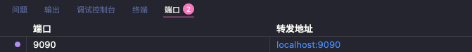

[TOC]

# 多语言

- [English Documentation (README_en)](README_en.md)

---

# 项目介绍

此项目是通过使用开源项目[clash（已跑路）](https://github.com/Dreamacro/clash)作为核心程序，再结合脚本实现简单的代理功能。<br>
clash核心备份仓库[Clash-backup](https://github.com/Elegycloud/clash-for-linux-backup)

主要是为了解决我们在服务器上下载GitHub等一些国外资源速度慢的问题。

# 免责声明
1.本项目使用GNU通用公共许可证（GPL）v3.0进行许可。您可以查看本仓库LICENSE进行了解

2.本项目的原作者保留所有知识产权。作为使用者，您需遵守GPL v3.0的要求，并承担因使用本项目而产生的任何风险。

3.本项目所提供的内容不提供任何明示或暗示的保证。在法律允许的范围内，原作者概不负责，不论是直接的、间接的、特殊的、偶然的或后果性的损害。

4.本项目与仓库的创建者和维护者完全无关，仅作为备份仓库，任何因使用本项目而引起的纠纷、争议或损失，与仓库的作者和维护者完全无关。

5.对于使用本项目所导致的任何纠纷或争议，使用者必须遵守自己国家的法律法规，并且需自行解决因使用本项目而产生的任何法律法规问题。

# 题外话
由于作者已经跑路，当前仓库仅进行备份，若有侵犯您的权利，请提交issues我会看到并删除仓库<br>

（2024/06/07 留：）其次就是，issue我没有时间回，很抱歉，欢迎各位来一起维护和解决这个仓库的问题！<br>

clash for linux 备份(备份号：202311091510)。
若喜欢本项目，请点个小星星！
<br>

# 使用须知

- 运行本项目建议使用root用户，或者使用 sudo 提权。
- 使用过程中如遇到问题，请优先查已有的 [issues](https://github.com/Elegycloud/clash-for-linux-backup/issues)。
- 在进行issues提交前，请替换提交内容中是敏感信息（例如：订阅地址）。
- 本项目是基于 [clash（已跑路）](https://github.com/Dreamacro/clash) 、[yacd](https://github.com/haishanh/yacd) 进行的配置整合，关于clash、yacd的详细配置请去原项目查看。
- 此项目不提供任何订阅信息，请自行准备Clash订阅地址，或准备已导出的 Clash YAML 配置文件。
- 运行前请手动更改`.env`文件中的`CLASH_URL`或`CLASH_CONFIG_FILE`变量值，二者只能配置一个，否则无法正常运行。
- 当前在RHEL系列和Debian,Kali Linux,ubuntu以及Linux系统中测试过，其他系列可能需要适当修改脚本。
- 支持 x86_64/aarch64 平台
- 【注意：部分带有桌面端Linux系统的需要在浏览器设置代理！否则有可能无法使用！】
- 【若系统代理无法使用，但是想要系统代理，请修改尝试修改start.sh中的端口后执行环境变量命令！】
- 【还是无法使用请更换当前网络环境（也是其中一个因素！）】
- 【部分Linux系统会出现谷歌，twitter，youtube等可能无法ping通，正常现象！】
> **注意**：当你在使用此项目时，遇到任何无法独自解决的问题请优先前往 [Issues](https://github.com/Elegycloud/clash-for-linux-backup/issue) 寻找解决方法。由于空闲时间有限，后续将不再对Issues中 “已经解答”、“已有解决方案” 的问题进行重复性的回答。

<br>

# 使用教程

## 快速使用

下载项目并进入目录：

```bash
$ git clone https://github.com/lzt2323/clash_linux.git clash-for-linux
$ cd clash-for-linux
```

复制配置模板：

```bash
$ cp .env.example .env
$ vim .env
```

> **注意：** `.env` 是你的私人配置文件，里面可能包含订阅地址、机场节点或 Clash Secret，不会提交到 GitHub。`.env` 文件中的变量 `CLASH_SECRET` 为自定义 Clash Secret，值为空时，脚本将自动生成随机字符串。

`.env` 中 `CLASH_URL` 和 `CLASH_CONFIG_FILE` 二选一，不要同时填写。

使用订阅地址：

```bash
export CLASH_URL='https://example.com/subscription'
# export CLASH_CONFIG_FILE='conf/my-clash.yaml'
```

或使用本地 Clash YAML，支持绝对路径或相对项目目录的路径：

```bash
export CLASH_URL=''
export CLASH_CONFIG_FILE='conf/my-clash.yaml'
```

本地 YAML 文件可以放在项目目录内，也可以使用绝对路径，例如：

```bash
export CLASH_URL=''
export CLASH_CONFIG_FILE='/home/user/downloads/clash.yaml'
```

<br>

## 启动程序

运行启动脚本：

```bash
$ cd clash-for-linux
$ sudo bash start.sh
```

启动脚本会完成这些操作：

- 从订阅地址下载 Clash 配置，或读取你指定的本地 YAML 文件。
- 生成最终运行配置 `conf/config.yaml`。
- 启动当前 CPU 架构对应的 Clash 核心。
- 写入 `/etc/profile.d/clash.sh`，提供 `proxy_on` 和 `proxy_off` 命令。
- 自动在当前用户的 `~/.bashrc` 中加载 `/etc/profile.d/clash.sh`，新开的终端可以直接使用 `proxy_on` / `proxy_off`。

启动成功后会看到类似输出：

```bash
正在检测订阅地址...
Clash订阅地址可访问！                                      [  OK  ]

正在下载Clash配置文件...
配置文件config.yaml下载成功！                              [  OK  ]

正在启动Clash服务...
服务启动成功！                                             [  OK  ]

Clash Dashboard 访问地址：http://<ip>:9090/ui
Secret：xxxxxxxxxxxxx

已配置新终端自动加载 proxy_on / proxy_off 命令

若当前终端需要立即使用，请执行: source /etc/profile.d/clash.sh

请执行以下命令开启系统代理: proxy_on

若要临时关闭系统代理，请执行: proxy_off

```

新开的终端可以直接开启系统代理：

```bash
$ proxy_on
```

如果是在执行 `start.sh` 的当前终端里立即使用，当前 shell 还没有重新加载配置，需要执行一次：

```bash
$ source /etc/profile.d/clash.sh
$ proxy_on
```

- 检查服务端口

```bash
$ netstat -tln | grep -E '9090|789.'
tcp        0      0 127.0.0.1:9090          0.0.0.0:*               LISTEN     
tcp6       0      0 :::7890                 :::*                    LISTEN     
tcp6       0      0 :::7891                 :::*                    LISTEN     
tcp6       0      0 :::7892                 :::*                    LISTEN
```

- 检查环境变量

```bash
$ env | grep -E 'http_proxy|https_proxy'
http_proxy=http://127.0.0.1:7890
https_proxy=http://127.0.0.1:7890
```

以上步骤如果正常，说明 Clash 服务启动成功。

<br>

## 重启程序

如果只是修改 `conf/config.yaml` 并重启 Clash，运行：

```bash
$ sudo bash restart.sh
```

> **注意：**
> 重启脚本 `restart.sh` 不会重新读取订阅地址或本地 YAML。需要更新订阅或重新读取 YAML 时，请重新执行 `sudo bash start.sh`。

<br>

## 停止程序

- 进入项目目录

```bash
$ cd clash-for-linux
```

- 关闭服务

```bash
$ sudo bash shutdown.sh
```

服务关闭成功后，如当前终端已开启系统代理，请执行：

```bash
$ proxy_off
```

然后检查程序端口、进程以及环境变量`http_proxy|https_proxy`，若都没则说明服务正常关闭。

```bash
$ ps -ef | grep '[c]lash-linux'
$ netstat -tln | grep -E '9090|789.'
$ env | grep -E 'http_proxy|https_proxy'
```


<br>

## Clash Dashboard

- 访问 Clash Dashboard

通过浏览器访问 `start.sh` 执行成功后输出的地址，例如：http://192.168.0.1:9090/ui

如果是在 VS Code 远程开发环境、云服务器、容器或 Notebook 环境里运行本项目，浏览器通常不能直接访问服务器内的 `9090` 端口。需要先在 VS Code 的“端口”面板中添加端口转发，将服务器端口 `9090` 转发到本地。



端口转发成功后，可以在本地浏览器访问：

```text
http://localhost:9090/ui
```

- 登录管理界面

在`API Base URL`一栏中输入：http://\<ip\>:9090 ，在`Secret(optional)`一栏中输入启动成功后输出的Secret。

点击Add并选择刚刚输入的管理界面地址，之后便可在浏览器上进行一些配置。

- 更多教程

此 Clash Dashboard 使用的是[yacd](https://github.com/haishanh/yacd)项目，详细使用方法请移步到yacd上查询。


<br>

## 终端界面选择代理节点

部分用户无法通过浏览器使用 Clash Dashboard 进行节点选择、代理模式修改等操作，为了方便用户可以在Linux终端进行操作，下面提供了一个功能简单的脚本以便用户可以临时通过终端界面进行配置。

脚本存放位置：`scripts/clash_proxy-selector.sh`

> **注意：**
>
> 使用脚本前，需要修改脚本中的 **Secret** 变量值为上述启动脚本输出的值，或者与 `.env` 文件中定义的 **CLASH_SECRET** 变量值保持一致。


<br>


# 常见问题

1. 部分Linux系统默认的 shell `/bin/sh` 被更改为 `dash`，运行脚本会出现报错（报错内容一般会有 `-en [ OK ]`）。建议使用 `bash xxx.sh` 运行脚本。

2. 部分用户在UI界面找不到代理节点，基本上是因为厂商提供的clash配置文件是经过base64编码的，且配置文件格式不符合clash配置标准。

   目前此项目已集成自动识别和转换clash配置文件的功能。如果依然无法使用，则需要通过自建或者第三方平台（不推荐，有泄露风险）对订阅地址转换。
   
3. 程序日志中出现`error: unsupported rule type RULE-SET`报错，解决方法查看官方[WIKI](https://github.com/Dreamacro/clash/wiki/FAQ#error-unsupported-rule-type-rule-set)
